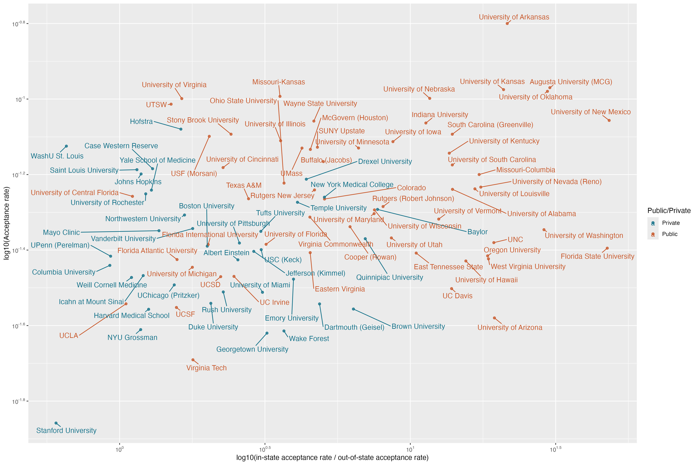
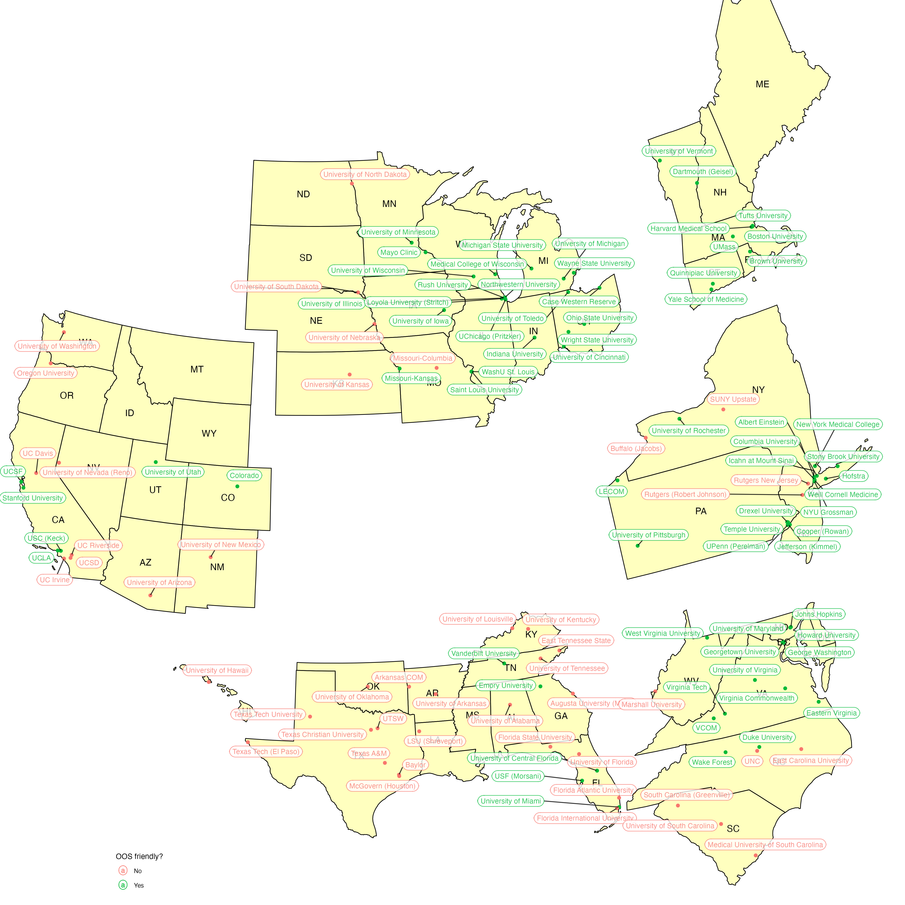

# Med School Stats Webscraping
Webscraping scripts for medical school admissions stats from [admit.org](https://admit.org/school-list-builder), a website/model built by reddit user Happiest_Rabbit and more thoroughly explained in [this post](https://www.reddit.com/r/premed/comments/1ap5ic5/admit_standardized_score_and_school_list_builder/). The purpose of these scripts is to be able to more easily maniplate the data about [accepted student statistics](https://admit.org/school-statistics) and [medical school curriculums](https://admit.org/school-curriculums). I also managed to scrape [this document](https://docs.google.com/spreadsheets/d/1tYAHFUP-X_Rj-nR1AerAMr5V5blIUV4_gkJ7p2COchk/edit?gid=514048617#gid=514048617) as well. It contains more detailed information about out-of-state and in-state acceptance rates from the 2020-2021 cycle.

## Quirks
There are 193 schools listed on admit.org, but when I scrape the tables from the web the resulting dataframes only have 191 rows/schools. I have no idea why, and I'm not CS person so someone else can figure it out bc I'm too lazy to. The 2020-2021 acceptance stats doc also only has data for 120 schools, which limits my analyses later on. 

## Figures!
### In-state bias among private/public schools

_Note. I calculate in-state bias as the $`\frac{\text{in-state acceptance rate}}{\text{out-of-state acceptance rate}}`$, which acts as a measure of how much a medical school favors in-state applicants in comparison to out-of-state applicants._

### Which public medical schools hate their own state's citizens? (haha jk...unless?)

_Note. I use the $`\frac{\text{in-state acceptance rate}}{\text{Average in-state acceptance rate among public schools}}`$ as a measure of how much a medical school favors in-state applicants in comparison to that of_ other _public medical schools. All of that to say_&mdash;_it's a \(not very well-thought-out/crude\) metric of how much a public medical school favors in-state applicants in comparison to how much other public medical schools favor in-state applicants._

### Random forest binary classification: Which states are objectively OOS friendly?
While there's some concensus about which schools are out-of-state friendly&mdash;notably, private schools and a handful of public schools, like Larner COM (@University of Vermont), UMich, and OSU&mdash;there's also a lot of mixed information about many other schools. Here, we use the data about IS and OOS applications, IIs, acceptances, enrollment, and location to generate a RF machine learning model to predict which schools are OOS friendly.
#### Evaluation metrics

#### Predictions

_Note. Yes, I am missing a lot of med schools, which sucks because the ML algorithm could better classify schools' OOS friendliness with a larger sample size. But also, making this map was hell_&mdash;_I can't imagine trying to add even more schools to it without throwing myself at the wall because it took so long to make everything readable and fit on one plot. Take these results with a grain of salt as no algorithm is perfect, and it's up to you which schools you're willing to go to :)_
